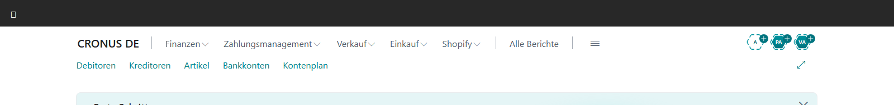
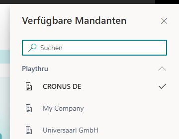
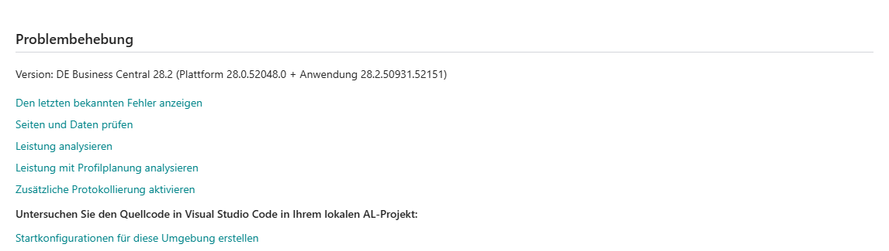
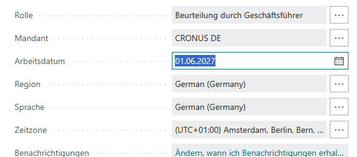
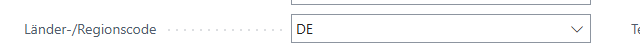

# Playthru-Umgebungsbaseline verstehen und lesen

Bevor ein Implementierungsprojekt Business Central einrichtet, muss klar sein, **wo** man arbeitet und **welcher Mandant** gerade aktiv ist. Dieses Kapitel fuehrt durch einen zweimal reproduzierten, rein lesenden Pilotablauf. Es ist ein kuratiertes Lernergebnis; technische Manifeste, Ereignisse und Traces bleiben getrennte Roh-Nachweise.

## Die Begriffe hinter dem Bildschirm

- Die **BC-Umgebung** ist die technische Sandbox oder Produktion. Hier wurde ausschliesslich die Sandbox `playthru` verwendet.
- Ein **Mandant beziehungsweise BC-Unternehmen** ist ein abgegrenzter Buchungs- und Datenbestand innerhalb einer Umgebung. Aktiv war `CRONUS DE`.
- **Lokalisierung** umfasst mehr als Sprache. Sprache `German (Germany)` und Laender-/Regionscode `DE` sind Indizien; erst installierte deutsche Apps und fachliche Tests koennen die Lokalisierung vollstaendig belegen.
- Die **Experience** steuert den sichtbaren Funktionsumfang einer Gesellschaft, beispielsweise Essentials oder Premium. Im Pilot war kein eindeutiges Experience-Feld sichtbar; der Wert bleibt deshalb `unknown`.
- Das **Arbeitsdatum** ist ein benutzerspezifischer Buchungskontext. Es kann vom Kalenderdatum abweichen und beeinflusst Vorschlagswerte fuer Buchungsdaten. Es ist keine Gesellschaftskonfiguration.

## Gepruefter Ausgangszustand

- Umgebung: `playthru`
- aktiver Mandant: `CRONUS DE`
- Client: `DE Business Central 28.2`
- Plattform: `28.0.52048.0`
- Anwendung: `28.2.50931.52151`
- Sprache und Region: `German (Germany)`
- Arbeitsdatum: `2027-06-01` als Benutzer-/Laufkontext
- Zeitzone: sichtbarer Benutzer-/Laufkontext aus **Meine Einstellungen**
- sichtbarer Laender-/Regionscode: `DE`
- Experience: `unknown`, weil auf der geprueften Seite kein eindeutiges sichtbares Feld vorhanden war

Der Code `DE` ist ein starkes Indiz fuer den Firmenkontext, beweist fuer sich allein aber nicht die vollstaendige deutsche Lokalisierungs- und App-Ausstattung.

*Abbildung 1: Der Kopfbereich trennt die technische Umgebung `playthru` vom aktiven Mandanten `CRONUS DE`.*

## Gepruefter Klickweg

1. Oeffnen Sie die lokal bereitgestellte Business-Central-URL ohne `company=`-Parameter. Pruefen Sie im Kopfbereich `playthru` und links oben `CRONUS DE`. [ENV-00]
2. Druecken Sie `Strg+O`. Das Pane **Verfuegbare Mandanten** oeffnet sich. Lesen Sie nur den Abschnitt **Playthru**; klicken Sie keinen Mandanten an. Schliessen Sie das Pane mit **Schliessen**. [ENV-01]
3. Waehlen Sie oben rechts **Hilfe** (`?`) und im Hilfebereich **Hilfe & Support**. Im Abschnitt **Problembehebung** steht die Version. Schliessen Sie den Hilfebereich und waehlen Sie **Zurueck**. [ENV-02]
4. Druecken Sie `Alt+T`. In **Meine Einstellungen** lesen Sie Mandant, Arbeitsdatum, Region, Sprache und Zeitzone. Beenden Sie den Dialog mit **Abbrechen**, nicht mit **OK**. [ENV-03]
5. Waehlen Sie oben rechts **Einstellungen** (Zahnrad) und **Unternehmensdaten**. Lesen Sie den Laender-/Regionscode und waehlen Sie **Zurueck**, ohne ein Feld zu veraendern. [ENV-04]
6. Druecken Sie `Alt+Q`, suchen Sie nach `Erweiterung` und waehlen Sie die angebotene Verwaltungsseite. Der gepruefte Client oeffnete **Installierte Erweiterungen**. Belegt sind nur die sechs Karten, deren Name und Herausgeber im Screenshot-Ausschnitt sichtbar sind; verwenden Sie weder **Verwalten** noch den AppSource-Katalog. [ENV-05]
7. Kehren Sie zurueck, druecken Sie `Alt+Q`, suchen Sie nach `Funktion` und waehlen Sie **Funktionsverwaltung**. Die 15 den Screenshot-Ausschnitt schneidenden Zeilen sind nur ein Teilnachweis. Verwenden Sie weder **Liste bearbeiten** noch eine Aktivierungs-/Aktualisierungsaktion. [ENV-06]

*Abbildung 2: Das Pane zeigt in `playthru` die zugaenglichen Namen `CRONUS DE`, `My Company` und `Universaarl GmbH`. Es wurde kein Eintrag ausgewaehlt.*

*Abbildung 3: Hilfe & Support ist die direkte sichtbare Quelle fuer Client-, Plattform- und Anwendungsversion.*

*Abbildung 4: Das Arbeitsdatum `01.06.2027` und die Zeitzone gehoeren zum Benutzer-/Laufkontext. Der Dialog wurde mit **Abbrechen** verlassen.*

*Abbildung 5: `DE` ist sichtbar, bleibt aber nur ein Teilnachweis fuer die deutsche Lokalisierung.*

## Konsequenz fuer Universaarl

Die geplanten V2-Unternehmen `UAM-DE`, `UAS-DE`, `UAD-DE`, `UAP-DE` und `UAC-CONS` wurden im zugaenglichen Playthru-Pane **nicht beobachtet**. Das beweist nicht, dass sie nirgendwo existieren; es beweist nur, dass sie in diesem sichtbaren Pane und unter der aktuellen Berechtigung nicht als solche erschienen. `Universaarl GmbH` ist ein anderer sichtbarer Name und darf nicht stillschweigend einem der fuenf Zielunternehmen gleichgesetzt werden.

Die Baseline ist durch den change-spezifischen automatisierten Policy-Pruefpunkt kanonisch synchronisiert. Das erlaubt trotzdem noch keinen Einrichtungsschreibvorgang: Anlage, Kopie oder Umbenennung brauchen einen eigenen freigegebenen Setup-Change mit Zielunternehmen, Zweck, Akzeptanzkriterien und Resetstrategie.

## Wichtige Grenzen

- Keine Umgebung und keinen Mandanten wechseln.
- Keine Felder fuellen, keine Erweiterung installieren/deinstallieren und keine Funktion aktivieren.
- Die sechs vollstaendig beschrifteten Erweiterungskarten und die 15 Funktionszeilen sind screenshot-belegte Teilmengen, keine garantierte Vollstaendigkeitsbescheinigung. Ausserhalb des sichtbaren Ausschnitts gerenderte DOM-Elemente gelten nicht als visuell geprueft.
- Release-Plaene ersetzen die sichtbaren Sandbox-Nachweise nicht.
- Ein abweichendes Arbeitsdatum muss vor spaeteren Buchungsnachweisen bewusst bestaetigt oder korrigiert werden; dieser Pilot veraendert es nicht.

Roh-Nachweise: `evidence/playthru-environment-baseline/run-1`, `run-2`, `comparison.json` und `visual-review.yaml`. Der technische Wiederholungs- und Fehlerablauf gehoert in das separate Berater-Runbook.

Interaktive Wiedergabe: `artifacts/walkthrough/generated/UABC-WT-ENV-001/index.html`. Sie ist eine abgeleitete Lernansicht und kein neuer Nachweis.
